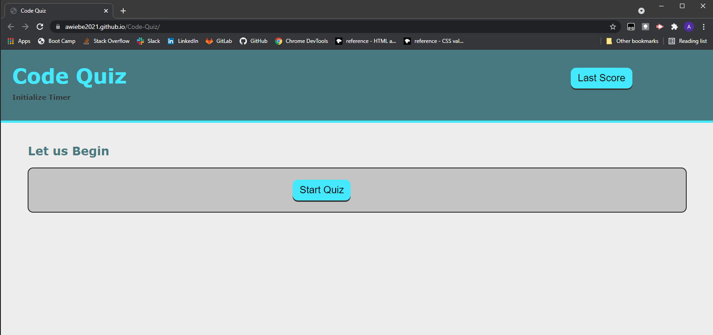

# Code-Quiz

## Description 

JavaScript Challenge: Password Generator
Challenge Elements
This week’s Challenge is to build a timed coding quiz with multiple-choice questions. This 
app will run in the browser, and will feature dynamically updated HTML and CSS powered by JavaScript 
code that you write. It will have a clean, polished, and responsive user interface. 

## Installation

The project can be viewed at: https://awiebe2021.github.io/Code-Quiz/
The projects code can be accessed at: https://github.com/AWiebe2021/Code-Quiz

## Screenshot

## Credits
Solo project this fourth week